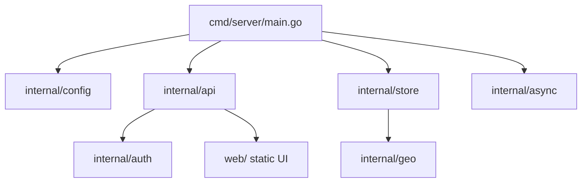
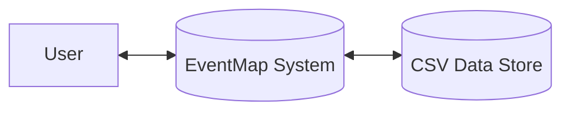
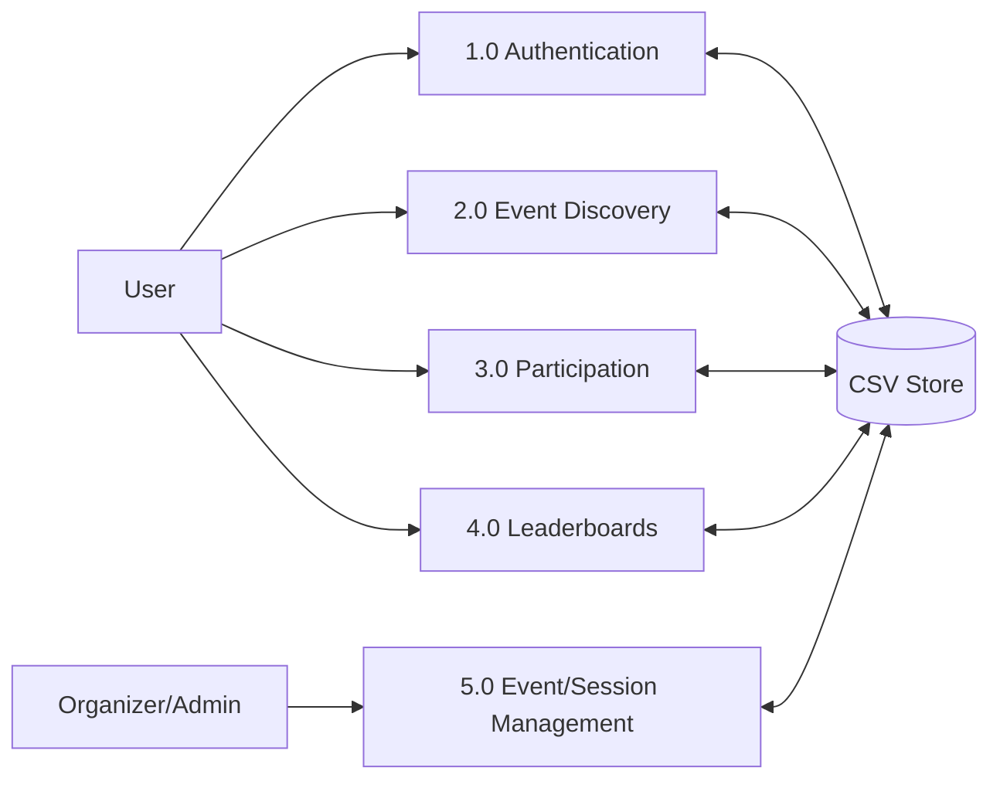
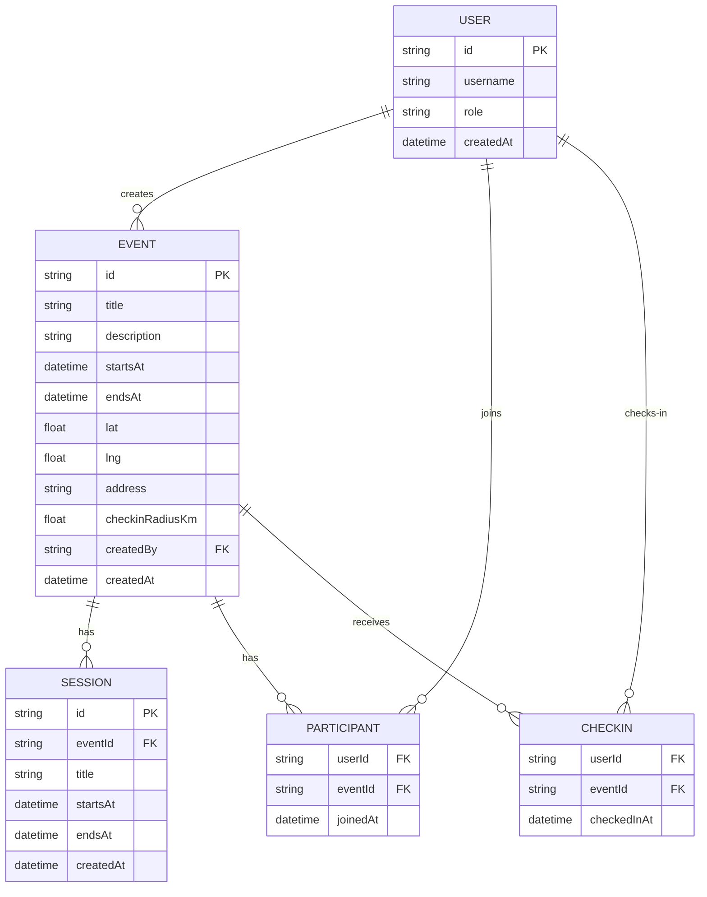
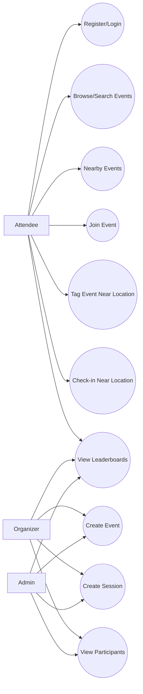
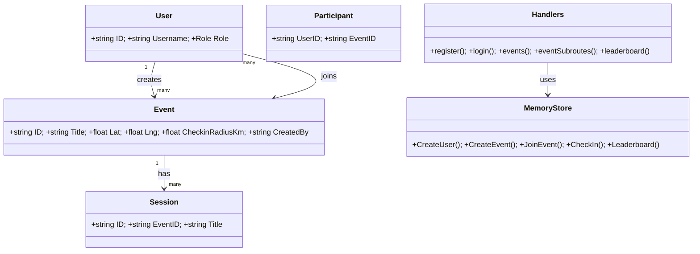
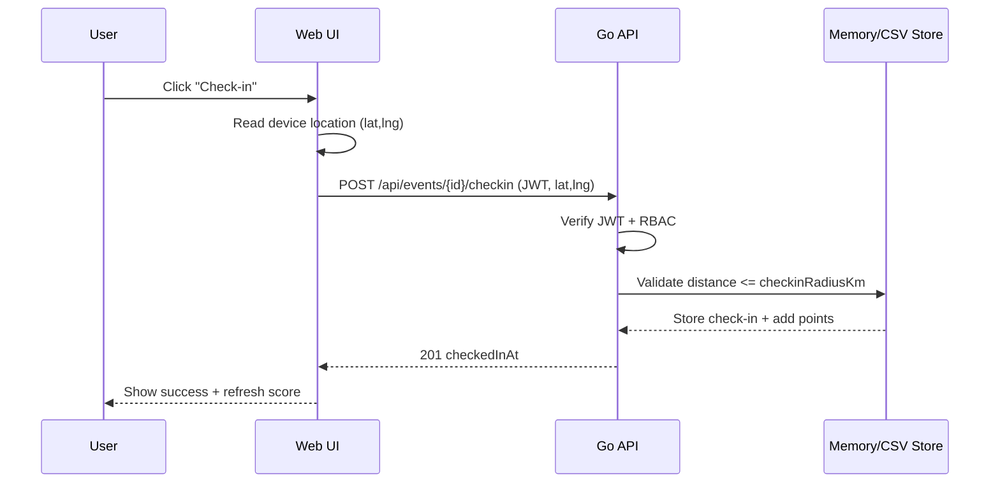

# Gandhi Institute of Engineering and Technology University, Gunupur  
## Dept. of CSE / CSE-DS / CSE-AIML  
### Minor Project Report (Format Compliance Document)

**Project Title:** EventMap (MVP) — Event Management Web App with Map UI  
**Academic Year/Semester:** <<AY 20XX–20XX, Semester VI>>  
**Submitted By:** <<Student Name(s), Roll No(s), Regd No(s), Section>>  
**Branch:** <<CSE / CSE-DS / CSE-AIML>>  
**Submitted To:** Department of CSE, GIET University, Gunupur  
**Project Guide:** <<Guide Name, Designation>>  
**Date of Submission:** <<DD Month YYYY>>

---

# 1. Front Page (Attached) — Color Page
Use the officially provided/front-page template and attach it here in the final print/PDF.

# 2. Certificate — Color Page
Attach the signed certificate page as provided by the department.

# 3. Acknowledgement — Color Page
**ACKNOWLEDGEMENT (Template)**  
I/We express our sincere gratitude to **GIET University, Gunupur**, Department of **CSE / CSE-DS / CSE-AIML**, for providing the opportunity to carry out the Minor Project titled **“EventMap (MVP)”**.  
I/We would like to thank our project guide **<<Guide Name>>** for continuous guidance, valuable suggestions, and support throughout the project.  
I/We also thank the Head of Department **<<HOD Name>>**, faculty members, and my/our classmates for their cooperation and encouragement.  
Finally, I/we thank my/our parents and friends for their constant support.

**Place:** <<Gunupur>>  
**Date:** <<DD Month YYYY>>  
**Submitted by:** <<Student Name(s)>>

# 4. Abstract (Maximum 2 Pages)
EventMap is a web-based event management application that visualizes events on an interactive map and supports common workflows such as user authentication, event discovery, event creation, session scheduling, participation tracking, and location-based engagement. The system is designed as a lightweight client–server application: a **Go (net/http)** backend exposes REST APIs secured by **JWT-based authentication** and basic **role-based access control (RBAC)**, while a static **Leaflet + OpenStreetMap** frontend provides a map-first user experience.

The core idea of EventMap is to reduce friction in event discovery and participation by combining: (1) a searchable list view, (2) a map view with markers and popups, and (3) “nearby” filtering using a geographic distance function (Haversine). For on-ground engagement, EventMap introduces **location-gated actions** such as *check-in* (within a configurable radius of the event location) and *tagging* (adding event tags only when the user is near the event). These actions also contribute to a simple points/XP system, enabling global and event-specific leaderboards to motivate participation.

For persistence, the backend stores data in memory during runtime and performs local durable storage using a **CSV-based database** in the `data/` directory (configurable via environment variables). The system also includes asynchronous background processing using goroutines and buffered queues to simulate **notification** and **analytics** pipelines. EventMap can run locally for development or be deployed via Docker, and the frontend can be hosted as static assets (e.g., Netlify) while the backend runs separately.

This report documents the problem context, requirements, analysis, architecture, design, and implementation details of EventMap, including system diagrams, pseudocode for critical processes, and a methodology describing the development approach.

# 5. Introduction
## 5.1 Purpose
The purpose of EventMap is to provide a simple, map-centric platform to:
- Discover events by location (nearby radius search) and by keywords/tags.
- Allow organizers/admins to create events and sessions.
- Allow attendees to join events, check in at the venue, and interact by tagging.
- Maintain engagement using points/XP and leaderboards.

## 5.2 Scope
EventMap is intended for small-to-medium event ecosystems such as campus events, seminars, club meets, workshops, and community gatherings.

In-scope:
- User registration/login with JWT token issuance.
- Roles: **attendee**, **organizer**, **admin** (RBAC enforcement at API level).
- Event creation (organizer/admin), session creation under events, participant tracking.
- Nearby events filtering using user/device location.
- Location-gated check-in and tagging near event coordinates.
- Points/XP and global/event leaderboards.
- Local persistence using CSV files.

Out-of-scope (for the MVP):
- Payment/ticketing integration.
- Real-time chat and push notifications (only simulated via async logs).
- Full admin console for user management.
- Advanced GIS features (routing, geocoding, clustering).

## 5.3 Features
Frontend (Web UI):
- Map view with markers (Leaflet + OpenStreetMap tiles).
- Search box and filters (tag, radius).
- “Locate” (geolocation) to center map on user position.
- Login/Register and guest browsing.
- Create Event form with pinned map coordinates (organizer/admin only).
- Event detail: join, tag near event, check-in, event tags display.
- Global and per-event leaderboards.

Backend (Go API):
- REST APIs for auth, events, sessions, participants, leaderboards.
- JWT verification middleware and RBAC middleware.
- Rate limiting, request IDs, logging.
- Async notification/analytics queues (worker goroutines).
- CSV load/save for persistence.

# 6. Literature Review
EventMap is informed by common patterns in:
- **Event management systems**: workflows like event creation, participant enrollment, and schedules/sessions.
- **Location-based services (LBS)**: geo-filtering (nearby search) and geofencing concepts (location-gated check-in).
- **Map-first interfaces**: interactive maps for spatial discovery, widely used in food delivery, travel, and venue-based apps.
- **Web security practices**: token-based authentication (JWT) and role-based authorization (RBAC) for protected operations.
- **Progressive Web Apps (PWA)**: improving mobile usability with installable web apps and offline-capable service workers (where applicable).

Compared to traditional list-only event apps, a map-centric approach improves discoverability and provides spatial context (distance, proximity, venue location). The MVP also demonstrates gamification concepts (XP, levels, leaderboards) as a lightweight engagement strategy without requiring complex recommendation engines.

# 7. System Analysis
## 7.1 User Requirements (SRS)
### 7.1.1 Stakeholders and User Roles
- **Attendee:** browses events, joins events, tags/checks in near venue, views leaderboards.
- **Organizer:** all attendee capabilities + creates events and sessions, views participants.
- **Admin:** same privileges as organizer (plus system defaults like seeded admin credentials).

### 7.1.2 Functional Requirements
FR1. User can register with username, password, and role (attendee/organizer).  
FR2. User can login and receive a JWT token.  
FR3. User can view all events and filter/search by keyword, tag, and radius.  
FR4. Organizer/Admin can create an event with title, time window, location, tags, and check-in radius.  
FR5. Organizer/Admin can create sessions under an event.  
FR6. User can join an event and become a participant.  
FR7. User can check in only if inside the event check-in radius.  
FR8. User can tag an event only when near the event (location gated).  
FR9. System calculates points/XP and exposes global and per-event leaderboards.  
FR10. System stores data persistently using CSV files and restores state on server restart.

### 7.1.3 Non-Functional Requirements
NFR1. **Security:** protect APIs via JWT and enforce RBAC on restricted routes.  
NFR2. **Performance:** handle typical campus-scale traffic; respond to list/nearby queries quickly.  
NFR3. **Reliability:** prevent data loss on restart via persistence; graceful shutdown with save.  
NFR4. **Usability:** map-first UI suitable for desktop and mobile layouts.  
NFR5. **Maintainability:** modular structure (api/auth/store/geo/async) with clear responsibilities.  
NFR6. **Scalability (future):** separate frontend hosting and backend deployment; storage can be replaced by DB.

## 7.2 Hardware Requirements
Server (development/hosting):
- CPU: Dual-core or higher
- RAM: 2 GB minimum (4 GB recommended)
- Storage: 200 MB+ (CSV data grows with usage)

Client (user device):
- Smartphone or PC with modern browser
- GPS/Location permission (optional but recommended for nearby/check-in)

## 7.3 Software Requirements
- OS: Windows/Linux/macOS (server can be hosted on Linux preferred)
- Backend: Go `1.22+`
- Frontend: Any modern browser (Chrome/Firefox/Edge/Safari)
- Optional: Docker (for containerized deployment)

# 8. System Design & Specifications
## 8.1 High Level Design (HLD)

### 8.1.1 Project Model (Architecture)
EventMap follows a client–server model:
- **Client:** Static web UI (`web/`) using Leaflet to render map + event markers
- **Server:** Go HTTP server exposing REST APIs (`/api/...`)
- **Persistence:** CSV files under `data/` (configurable `CSV_DB_DIR`)
- **Async subsystem:** background goroutines for analytics/notifications (queued jobs)

Mermaid block diagram (HLD):
```mermaid
flowchart LR
  A[User Browser (PWA)] -->|HTTP/JSON| B[Go Backend net/http]
  B -->|Serve static assets| C[web/ (HTML/CSS/JS)]
  B -->|Read/Write| D[CSV Storage (data/*.csv)]
  B -->|Enqueue jobs| E[Async Runner (goroutines)]
  E -->|Logs/Telemetry| F[(Console Logs)]
```

### 8.1.2 Structure Chart (Module Decomposition)


### 8.1.3 Data Flow Diagram (DFD)
**DFD Level 0 (Context Diagram):**


**DFD Level 1 (Major Processes):**


### 8.1.4 E-R Diagram (Database Design)
Although persistence is implemented via CSV files, the logical ER model is:

Note: Event tags are stored as a list attribute in the event record (CSV field), but can be normalized into a separate `TAG` entity in future enhancements.

### 8.1.5 UML Diagrams

#### (a) Use Case Diagram


#### (b) Class / Object Diagram (Simplified)


#### (c) Interaction (Sequence) Diagram — Check-in Flow


## 8.2 Low Level Design (LLD)
### 8.2.1 Process Specification (Pseudocode / Algorithms)

**Algorithm 1: Haversine Distance (km)**  
Used in nearby search and location gating.
```text
function DistanceKm(lat1, lng1, lat2, lng2):
  R = 6371.0
  dLat = toRad(lat2 - lat1)
  dLng = toRad(lng2 - lng1)
  a = sin(dLat/2)^2 + cos(toRad(lat1)) * cos(toRad(lat2)) * sin(dLng/2)^2
  c = 2 * atan2(sqrt(a), sqrt(1-a))
  return R * c
```

**Algorithm 2: JWT-Based Request Authentication (Middleware)**
```text
if Authorization header missing:
  continue as guest (no user in context)
else:
  validate "Bearer <token>"
  verify token signature + exp using server secret
  load user by claims.sub
  attach user to request context
```

**Algorithm 3: Create Event (Organizer/Admin)**
```text
require role in {admin, organizer}
validate request body (title, times RFC3339, lat,lng)
normalize tags
if checkinRadiusKm <= 0: set default 0.2
store event; award creator points (+50)
persist to CSV (best effort)
enqueue analytics + notification jobs
return created event JSON
```

**Algorithm 4: Tag Event Near Location (Location Gated)**
```text
require authenticated user
normalize tag (lowercase, trim, replace spaces, limit length)
load event
if DistanceKm(userLat,userLng,eventLat,eventLng) > 0.75:
  deny (forbidden)
if tag already present: no-op
else add tag to event; award points (+5)
persist to CSV (best effort)
return updated event
```

**Algorithm 5: Check-in (Geofenced)**
```text
require authenticated user
load event
r = event.checkinRadiusKm (default 0.2)
if DistanceKm(userLat,userLng,eventLat,eventLng) > r:
  deny (forbidden)
if already checked in: deny (conflict)
else store check-in timestamp; award points (+30)
persist to CSV (best effort)
return checkedInAt
```

**Algorithm 6: Leaderboard**
```text
global leaderboard:
  sort all users by total points desc
event leaderboard:
  sort per-event points by points desc
limit = query param (default 20)
```

### 8.2.2 Screen-Shot Diagram
Insert actual UI screenshots here in the final report (recommended screenshots):
1. Home/Login/Register panel
2. Map view with event markers and pinned location
3. Create Event form (Organizer/Admin)
4. Event detail actions (Join, Tag, Check-in)
5. Global and Event leaderboard panels
6. API test snapshots (Postman/cURL) for key endpoints

Wireframe (optional):
```text
┌──────────────────────── Top Bar (Search/Filters/User) ───────────────────────┐
│ Brand | Search | Tag Filter | Radius | Locate | Refresh | User/Score | Logout│
└─────────────────────────────────────────────────────────────────────────────┘
┌──────────── Sidebar (Profile/Auth/Create/LB) ────────────┐ ┌──── Content ────┐
│ Profile (XP bar, level)                                  │ │ Map (Leaflet)    │
│ Auth (Login/Register/Guest)                              │ │ + markers/popup  │
│ Create (New Event form) [organizer/admin]                │ └──────────────────┘
│ Leaderboards (Global + Event)                            │ ┌ Events/List      │
└──────────────────────────────────────────────────────────┘ │ Event detail +    │
                                                             │ Join/Tag/Check-in │
                                                             └───────────────────┘
```

# 9. Methodology Section
## 9.1 Approach Used
EventMap is developed using an iterative, modular approach:
- Requirement identification (core event flows + map-based discovery)
- Design of REST APIs and data model
- Implementation of backend modules (auth, store, geo, async, api)
- Implementation of frontend UI (map markers, filters, auth, create flow)
- Integration and testing using browser + API calls
- Deployment readiness with Docker + static hosting for frontend

## 9.2 Algorithms / Models (Especially for AIML Projects)
This project is not an AIML model-based system; however, it uses key algorithms and models relevant to systems and web development:
- **Haversine distance** for nearby filtering and geofence checks.
- **JWT claim model** (sub/role/iat/exp) for stateless authentication.
- **RBAC model** to restrict organizer/admin features.
- **Points/XP model**: create (+50), join (+10), tag (+5), check-in (+30), with level = `floor(points/100)+1`.

---

## Appendix (Optional)
### A. API Endpoints (Summary)
- `POST /api/auth/register`
- `POST /api/auth/login`
- `GET /api/me`
- `GET /api/events`
- `GET /api/events/nearby?lat=..&lng=..&radius_km=..`
- `POST /api/events` (organizer/admin)
- `GET/POST /api/events/{id}/sessions` (POST organizer/admin)
- `POST /api/events/{id}/join`
- `POST /api/events/{id}/tag`
- `POST /api/events/{id}/checkin`
- `GET /api/leaderboard`
- `GET /api/events/{id}/leaderboard`

### B. Deployment Notes (Optional)
- Local run: `go run ./cmd/server` and open `http://localhost:8080`
- Persistent directory: set `CSV_DB_DIR=./data`
- Docker: build and run container; set `PUBLIC_ORIGIN` as required.
