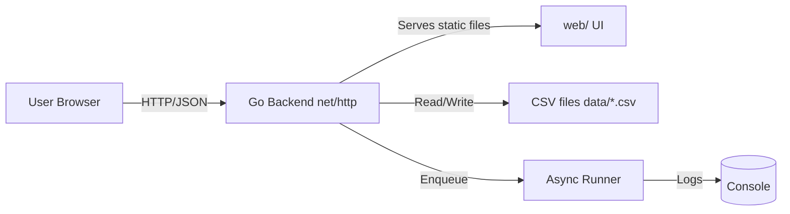
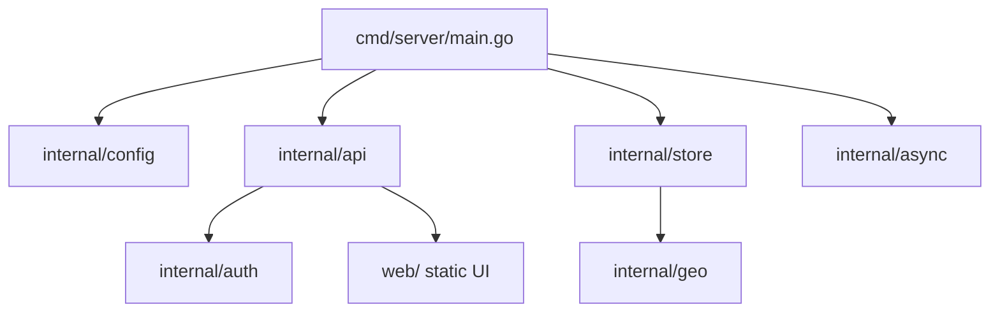
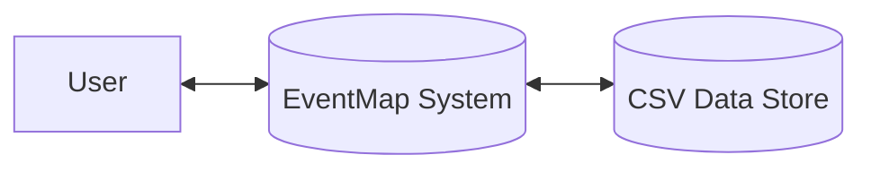
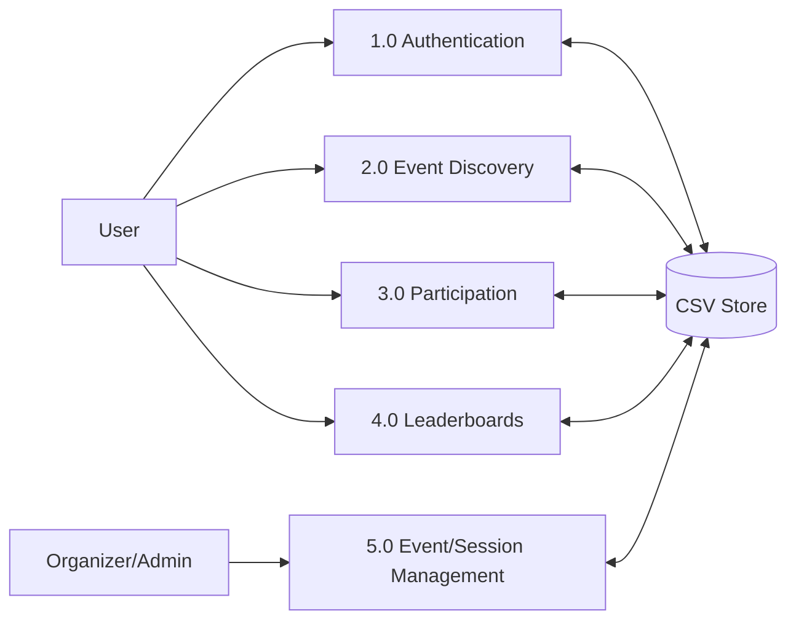
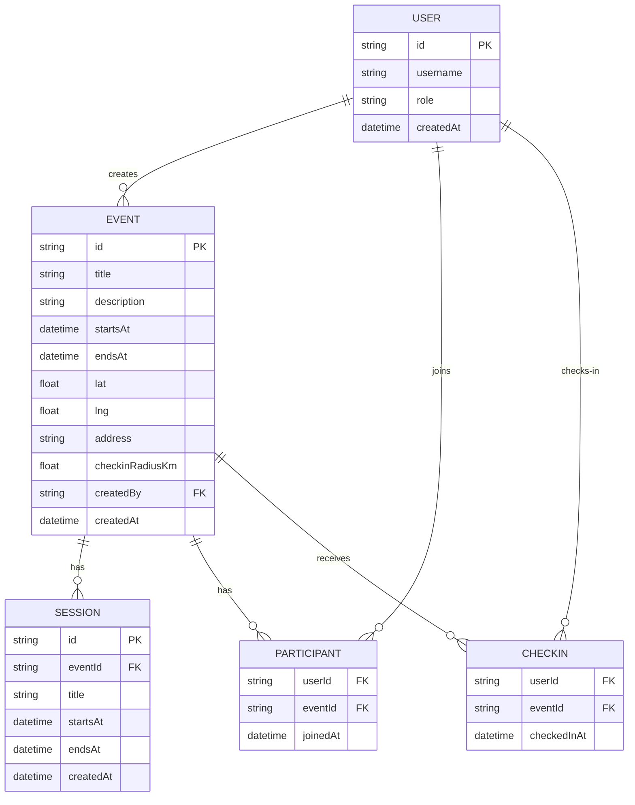
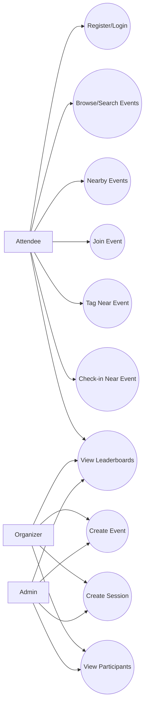
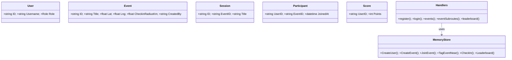
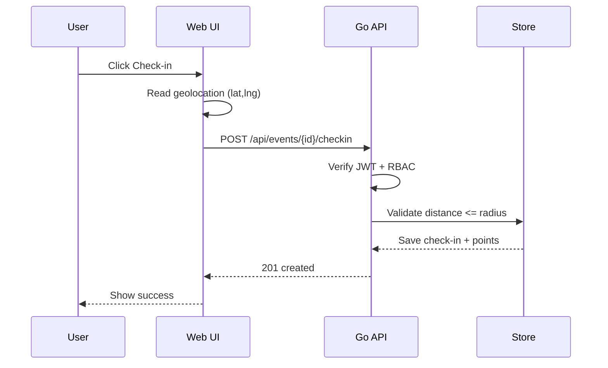

# Gandhi Institute of Engineering and Technology University, Gunupur  
## Department of CSE / CSE-DS / CSE-AIML  
### Minor Project Report (Detailed Version)

**Project Title:** EventMap (MVP) — Event Management Web App with Map UI  
**Academic Year/Semester:** <<AY 20XX–20XX, Semester VI>>  
**Submitted By:** <<Student Name(s), Roll No(s), Regd No(s), Section>>  
**Branch:** <<CSE / CSE-DS / CSE-AIML>>  
**Submitted To:** Department of CSE, GIET University, Gunupur  
**Project Guide:** <<Guide Name, Designation>>  
**HOD:** <<HOD Name>>  
**Date of Submission:** <<DD Month YYYY>>  

> Note on “30 pages”: page count depends on font, spacing, and margins. This document is intentionally written with enough depth/sections to exceed **30 pages** when exported to A4 with typical academic formatting (e.g., 12pt font, 1.5 line spacing, standard margins).  

\pagebreak

# Certificate (Color Page)
Attach the certificate page as per the department format (signed by guide/HOD).  

\pagebreak

# Acknowledgement (Color Page)
I/We express our sincere gratitude to **GIET University, Gunupur**, Department of **CSE / CSE-DS / CSE-AIML**, for providing the opportunity to carry out the Minor Project titled **“EventMap (MVP)”**.  
I/We sincerely thank our project guide **<<Guide Name>>** for continuous guidance, timely feedback, and motivation throughout the project.  
I/We also thank the Head of Department **<<HOD Name>>** and all faculty members for their encouragement and support.  
Finally, I/we thank my/our parents and friends for their constant support and cooperation during the project work.

**Place:** Gunupur  
**Date:** <<DD Month YYYY>>  
**Submitted by:** <<Student Name(s)>>  

\pagebreak

# Abstract (Maximum 2 Pages)
EventMap is a map-centric event management web application designed to make event discovery, participation, and on-ground engagement simple and measurable. The core motivation behind EventMap is that many campus and community events are location-dependent, yet traditional event portals present them primarily as text lists. EventMap addresses this by presenting events on an interactive map and enabling nearby discovery based on user location. This approach improves spatial understanding for attendees and reduces friction in deciding which events are reachable or relevant.

The system is implemented as a lightweight client–server web application. The backend is built in **Go** using the standard `net/http` stack and exposes REST APIs for authentication, event management, sessions, participation, and leaderboards. Security is implemented using **JWT-based authentication**, and privileged actions are restricted using basic **Role-Based Access Control (RBAC)** across roles such as *attendee*, *organizer*, and *admin*. The frontend is a static web UI built using HTML/CSS/JavaScript, with **Leaflet** and **OpenStreetMap tiles** providing a responsive and user-friendly map experience.

EventMap includes location-aware features beyond simple map display. It supports a nearby search feature powered by geographic distance computation (Haversine). It also implements location-gated actions: users can “tag” an event (add descriptive tags) only when they are physically near the event location, and they can check-in only when they are inside a configurable radius. These flows help reduce fake check-ins and support real-world presence-based engagement.

To motivate participation, EventMap introduces a simple points/XP system. Meaningful actions such as creating events, joining events, tagging, and checking in award points. The system computes levels from points and provides a global leaderboard and per-event leaderboards. Data persistence is implemented using CSV files stored in a configurable directory, enabling the project to remain database-free for MVP demonstrations while still maintaining state across server restarts. The backend also contains an asynchronous runner (goroutines + buffered queues) to simulate notifications and analytics processing.

This report presents the problem statement, objectives, requirements, analysis, system design, implementation details, test plan, deployment strategy, and user manual. It also provides diagram templates (HLD, DFD, ER, UML), pseudocode for critical processes, and a methodology section explaining the development approach and future enhancements.

\pagebreak

# Table of Contents
1. Introduction  
2. Problem Statement & Objectives  
3. Scope and Limitations  
4. Literature Review  
5. System Analysis (SRS)  
6. System Design & Specifications (HLD + LLD)  
7. Database / Data Storage Design  
8. Implementation Details  
9. Testing & Validation  
10. Deployment & User Manual  
11. Methodology & Project Management  
12. Results, Discussion, and Future Scope  
13. Conclusion  
14. References (To be finalized)  
15. Appendix (Screenshots, Sample Data, API Examples)  

\pagebreak

# 1. Introduction
## 1.1 Background
Events are a fundamental part of academic and social environments: workshops, club meets, seminars, hackathons, cultural programs, and sports activities. A common challenge is that while event information is often published on posters, messaging apps, or simple web pages, users still face multiple problems:

- They cannot easily understand the **geographical distribution** of events.
- They cannot quickly decide which events are **nearby** and reachable.
- Organizers struggle to maintain accurate lists of participants and to measure engagement beyond attendance.
- Existing solutions can be over-complicated or require paid platforms, heavy setup, or database infrastructure.

EventMap is developed as an MVP (Minimum Viable Product) to demonstrate that a map-first interface combined with lightweight backend services can provide a practical and engaging event experience.

## 1.2 Motivation
The motivation of this project is to combine:

1) **Spatial discovery**: a map that directly shows where events are happening.  
2) **Simple management**: organizers can create events and sessions without complex dashboards.  
3) **On-ground engagement**: location-based check-in and tagging create a stronger connection between digital event data and real physical participation.  
4) **Measurement**: leaderboards, points, and participation data help quantify engagement.

## 1.3 Purpose of the Project
The purpose of EventMap is to build a working demonstration system that can:

- Provide event discovery via list + map.
- Enable role-based event creation and scheduling.
- Support participant joining and tracking.
- Provide location-gated operations (tagging and check-in).
- Provide a simple XP-based ranking system.
- Persist data locally using CSV for easy demos and portability.

## 1.4 Report Organization
This report is structured to follow the standard Minor Project report format. It begins with requirements and analysis, then covers high-level and low-level design, implementation specifics, testing, deployment, and future enhancements. Each section is written in detail to support academic evaluation and reproducibility.

\pagebreak

# 2. Problem Statement & Objectives
## 2.1 Problem Statement
Design and implement a web application that allows users to discover events on an interactive map, supports event creation and scheduling for authorized organizers, and implements location-based participation features (tagging and check-in). The system should be secure (authentication + authorization), provide persistence, and be deployable for demonstration and real usage in a small-to-medium environment (such as a campus).

## 2.2 Objectives
### 2.2.1 Primary Objectives
- Build a map-first UI for exploring events.
- Implement user authentication and role-based authorization.
- Support event creation with coordinates and schedule information.
- Support joining events and listing participants.
- Implement location-gated tagging and check-in.
- Implement points/XP and leaderboards.

### 2.2.2 Secondary Objectives
- Provide local persistence without requiring a database server.
- Provide basic deployment readiness using Docker.
- Provide documentation, diagrams, and testing plans suitable for academic submission.

## 2.3 Expected Outcomes
At the end of the project:
- A working backend server exposes APIs for authentication and event workflows.
- A working frontend provides an interactive map UI with event management actions.
- Data persists across restarts via CSV storage.
- Users can perform real workflows: register, login, create event, join, check-in, view leaderboards.

\pagebreak

# 3. Scope and Limitations
## 3.1 In-Scope Features (MVP)
### Authentication & Authorization
- User registration with username/password and role selection (*attendee* or *organizer*).
- Login and JWT token issuance.
- RBAC checks on restricted routes.

### Events & Sessions
- Create events with: title, description, start/end time, lat/lng, tags, address, check-in radius.
- List events and fetch single event details.
- Create sessions under an event (organizer/admin).
- List sessions per event.

### Participation & Engagement
- Join events.
- List participants (organizer/admin).
- Tag an event only when near the venue.
- Check-in only when inside event check-in radius.
- Earn points and levels for actions.
- Global leaderboard and per-event leaderboards.

### Storage & Async Jobs
- CSV persistence for users, events, sessions, participants, points, check-ins.
- Asynchronous “analytics/notification” job queues (simulated).

## 3.2 Out-of-Scope Features (Not implemented in MVP)
- Payment processing, ticket generation, or QR tickets.
- Complex admin management (ban users, moderation UI).
- Real push notifications (Firebase/APNs); only simulated logs.
- Advanced GIS capabilities such as routing, turn-by-turn navigation, geocoding.
- Real-time features (websocket-based updates, chat).
- Production-grade anti-spoofing for location; MVP trusts client coordinates.

## 3.3 Limitations
- CSV storage is simple and suitable for small-scale demos. For large-scale deployments, a database would be required.
- Geo-fencing depends on accurate GPS readings and user permission.
- Security is appropriate for MVP, but production deployments require stronger secrets management, TLS, audit logs, and hardened configuration.

\pagebreak

# 4. Literature Review
> This section is written in a general academic style. Replace or supplement with specific papers/books/web references required by your department.

## 4.1 Event Management Systems
Event management software typically addresses creation, scheduling, registrations, participant communication, and reporting. Large solutions often include ticketing, marketing automation, and CRM integrations. However, for a campus or local environment, a lightweight solution is often sufficient. The main challenge is balancing simplicity and usability with the ability to track participation effectively.

EventMap implements the essential operations:
- Create event and sessions (schedule).
- Join event and maintain participant mapping.
- Provide event discovery and filtering.

## 4.2 Location-Based Services (LBS)
Location-based services use geospatial data and user location to provide relevant results. Typical patterns include:
- Nearby search using a radius.
- Geo-fencing for restricting certain operations.
- Proximity-based recommendations.

EventMap applies a practical nearby-search model using the Haversine distance function. It also applies geo-fencing constraints to ensure that tagging and check-in are meaningful and location-aware.

## 4.3 Map-Centric User Interfaces
Maps are widely used for spatial browsing: ride-sharing, food delivery, tourism, and local discovery applications. The key benefit is that users can visually understand distribution and distance without reading a long list. Leaflet and OpenStreetMap are popular open technologies for building such applications without vendor lock-in.

EventMap uses Leaflet to:
- Render a map view.
- Display event markers and popups.
- Support clicks for “pinning” event creation coordinates.

## 4.4 Web API Security (JWT + RBAC)
JWT tokens are a common approach for stateless authentication where each request carries proof of authorization (a signed token). RBAC restricts actions by role. While advanced authorization models exist (ABAC, policy-based systems), RBAC is a standard and practical approach for small-to-medium apps.

EventMap uses:
- JWT for identity + session validity.
- RBAC middleware to restrict event creation and participant listing to specific roles.

## 4.5 Gamification for Participation
Gamification uses points, levels, badges, and leaderboards to motivate engagement. In simple systems, points are assigned to actions to reward participation. In event systems, gamification can encourage attendance, check-ins, and social interaction.

EventMap includes a minimal points system with:
- Action-based points.
- Levels derived from points.
- Global and event-specific leaderboards.

\pagebreak

# 5. System Analysis (SRS)
## 5.1 Overall Description
### 5.1.1 Product Perspective
EventMap is a standalone web system that can run as a single Go server:
- Serves static frontend files.
- Exposes REST APIs.
- Reads/writes CSV files for persistence.

The architecture is modular so it can later evolve into a multi-service system or can switch persistence to a relational database.

### 5.1.2 Product Functions (High-Level)
- User authentication (register/login) and profile retrieval.
- Event listing and nearby search.
- Event creation and session scheduling.
- Participation management (join, participant list).
- Location-based tagging and check-in.
- Leaderboards and scoring.

### 5.1.3 User Classes and Characteristics
Attendee:
- Primary consumer of events.
- Often mobile users.
- Needs easy joining and check-in.

Organizer:
- Needs event creation and schedule handling.
- Needs participant list access.

Admin:
- Similar to organizer in MVP.
- May require seeded default admin credentials.

### 5.1.4 Operating Environment
- Backend: runs on any OS supporting Go or Docker (Linux preferred for deployment).
- Frontend: runs in modern browsers.
- Network: typical LAN/Internet connectivity.

### 5.1.5 Design Constraints
- Avoid external database requirement for MVP.
- Keep the solution deployable and easy to demonstrate.
- Use open mapping resources where possible (OSM).

### 5.1.6 Assumptions and Dependencies
- Users have access to a modern browser.
- Location permission may be denied; app still supports browsing events (guest mode).
- Backend requires a secure secret in production; MVP can generate temporary secret if not set.

\pagebreak

## 5.2 Specific Requirements
### 5.2.1 Functional Requirements (Detailed)
FR1. Registration  
The system shall allow users to register using a username and password and select a role (attendee/organizer).

FR2. Login  
The system shall allow registered users to log in and shall issue a JWT token upon successful authentication.

FR3. Guest browsing  
The system shall allow users to browse events without login, but restricted actions shall require authentication.

FR4. Profile  
The system shall provide a profile endpoint to return user identity and score details (points, level).

FR5. List events  
The system shall provide an API to list all events.

FR6. Nearby events  
The system shall provide an API to list events within a radius of a given location.

FR7. Create event  
The system shall allow only organizer/admin roles to create events with required information (title, times, lat/lng).

FR8. Sessions  
The system shall support creating sessions under an event and listing sessions of an event.

FR9. Join event  
The system shall allow authenticated users to join an event once; duplicate joins should be rejected.

FR10. Participants list  
The system shall allow organizer/admin to view participants for a given event.

FR11. Tag event (location-gated)  
The system shall allow a user to add a tag to an event only when near the event location.

FR12. Check-in (geofence)  
The system shall allow a user to check in only when inside the event’s check-in radius and only once per event.

FR13. Scoring and levels  
The system shall award points for actions and compute levels from points.

FR14. Leaderboards  
The system shall support global leaderboard and per-event leaderboard retrieval with a limit parameter.

FR15. Persistence  
The system shall persist data using CSV files and restore data during startup.

FR16. Logging and request tracing  
The system shall log requests with request IDs for debugging.

FR17. Rate limiting  
The system shall apply a basic rate limit per client IP to reduce abuse.

\pagebreak

### 5.2.2 Non-Functional Requirements (Detailed)
Security:
- Passwords must not be stored in plaintext.
- JWT tokens must have expiration and must be verified on protected routes.
- Restricted operations must enforce RBAC.

Performance:
- Listing events should be efficient for typical campus loads.
- Nearby filtering should respond quickly.

Reliability:
- On shutdown, the system should persist data.
- Persistence errors should be logged.

Usability:
- UI should be understandable to first-time users.
- Mobile layout should remain usable.

Maintainability:
- Code should be modular and readable.
- APIs should have consistent JSON error shapes.

Portability:
- The system should run locally without external dependencies (database).
- Docker deployment should be supported for easy hosting.

\pagebreak

### 5.2.3 External Interface Requirements
User Interface:
- Map panel showing event markers.
- Sidebar for authentication and creation.
- Filters for search, tag, radius.
- Event detail panel with actions and distance display.

API Interface:
- JSON request/response.
- Bearer token in `Authorization` header for authenticated actions.

Storage Interface:
- CSV files for persistence.
- Configurable directory path.

\pagebreak

# 6. System Design & Specifications
## 6.1 High Level Design (HLD)
### 6.1.1 Architecture Overview
EventMap architecture is designed to be:
- Simple to deploy (single server).
- Easy to understand (clear modules).
- Extendable (storage can be replaced).

Major building blocks:
1) Browser UI (static files under `web/`)
2) Go backend REST APIs (under `internal/api`)
3) In-memory store + persistence (`internal/store`)
4) JWT auth (`internal/auth`)
5) Geo utilities (`internal/geo`)
6) Async runner (`internal/async`)

### 6.1.2 Project Model (HLD Diagram)
Mermaid (can be exported as image):


### 6.1.3 Structure Chart (Module Decomposition)


\pagebreak

### 6.1.4 Data Flow Diagram (DFD)
DFD Level 0:


DFD Level 1:


\pagebreak

### 6.1.5 ER Diagram (Logical Model)


\pagebreak

## 6.2 UML Diagrams
### 6.2.1 Use Case Diagram


### 6.2.2 Class Diagram (Simplified)


### 6.2.3 Sequence Diagram — Check-in


\pagebreak

## 6.3 Low Level Design (LLD)
### 6.3.1 Key Algorithms (Pseudocode)
#### A) Haversine Distance (km)
```text
function DistanceKm(lat1, lng1, lat2, lng2):
  R = 6371.0
  lat1R = toRad(lat1)
  lat2R = toRad(lat2)
  dLat = toRad(lat2 - lat1)
  dLng = toRad(lng2 - lng1)
  a = sin(dLat/2)^2 + cos(lat1R) * cos(lat2R) * sin(dLng/2)^2
  c = 2 * atan2(sqrt(a), sqrt(1-a))
  return R * c
```

#### B) Registration
```text
validate username: 3..32, allowed characters
validate password: 6..72
validate role in {attendee, organizer}
generate user id, salt
hash password with salt + iterations
store user and index by username
persist store
return 201 created
```

#### C) Login
```text
load user by username
hash provided password with user's salt + iterations
compare hashes (constant-time compare)
if ok: sign JWT (sub=userID, role, iat, exp)
return token + user details
```

#### D) Create Event (Organizer/Admin)
```text
require auth + role in {organizer, admin}
parse times in RFC3339
normalize tags
default checkin radius if missing
store event + award points
persist store
enqueue analytics and notification jobs
return event JSON
```

#### E) Nearby Events
```text
for each event:
  if DistanceKm(userLat,userLng,eventLat,eventLng) <= radiusKm:
     include
return filtered list
```

#### F) Tag Event Near Location
```text
require auth
normalize tag string
load event
if DistanceKm(userLat,userLng,eventLat,eventLng) > 0.75: forbidden
if tag already exists: return
else append tag, sort tags, award points
persist store
return updated event
```

#### G) Check-in
```text
require auth
load event
r = event.checkinRadiusKm (default 0.2)
if DistanceKm(userLat,userLng,eventLat,eventLng) > r: forbidden
if already checked in: conflict
else save check-in time, award points
persist store
return checkedInAt
```

\pagebreak

# 7. Database / Data Storage Design (CSV)
## 7.1 Rationale for CSV Persistence
For a minor project MVP, CSV persistence offers:
- Easy portability (no DB server setup).
- Simple transparency (files are readable).
- Suitable durability for demos and small usage.

However, it is not intended for heavy concurrent production usage.

## 7.2 CSV Files and Logical Schemas
The store persists multiple files (names may include):
- `users.csv`: user identity, role, password hash data.
- `events.csv`: event details including location, tags, radius, creator.
- `sessions.csv`: event sessions.
- `participants.csv`: join records.
- `user_points.csv`: total points per user.
- `event_points.csv`: per-event points breakdown.
- `checkins.csv`: check-in timestamps.

## 7.3 Example CSV Rows (Illustrative)
users.csv (header + sample row):
```text
id,username,role,salt,password_hash_b64,created_at
u123,alice,attendee,somesalt,BASE64HASH,2026-01-01T10:00:00Z
```

events.csv:
```text
id,title,description,starts_at,ends_at,lat,lng,address,tags,checkin_radius_km,created_by,created_at
e001,Workshop,Go+Leaflet demo,2026-04-10T09:00:00Z,2026-04-10T12:00:00Z,19.0760,72.8777,Campus,music|meetup,0.2,u123,2026-04-09T08:00:00Z
```

participants.csv:
```text
user_id,event_id,joined_at
u123,e001,2026-04-09T09:30:00Z
```

checkins.csv:
```text
event_id,user_id,checked_in_at
e001,u123,2026-04-10T09:15:00Z
```

\pagebreak

# 8. Implementation Details (EventMap Codebase)
> This section documents how the repository is structured and how each module contributes to the system.

## 8.1 Repository Structure
Typical directories:
- `cmd/server/`: server entrypoint
- `internal/api/`: HTTP handlers and middleware
- `internal/auth/`: JWT signing and verification
- `internal/config/`: environment configuration
- `internal/store/`: in-memory store + CSV persistence + models
- `internal/geo/`: geo computations
- `internal/async/`: background runner
- `web/`: frontend UI

## 8.2 Backend Server Lifecycle
The server starts by:
1) Loading configuration from environment.
2) Creating async runner.
3) Creating in-memory store.
4) Loading data from CSV directory.
5) Seeding default admin user (optional).
6) Building API handler and starting `http.Server`.
7) Handling graceful shutdown and persistence save.

## 8.3 Configuration
Key environment variables (MVP):
- `PORT`
- `PUBLIC_ORIGIN`
- `JWT_SECRET`
- `TOKEN_TTL`
- `PASSWORD_ITERATIONS`
- `CSV_DB_DIR`
- `DEFAULT_ADMIN_USERNAME`, `DEFAULT_ADMIN_PASSWORD`

## 8.4 Authentication and Authorization
### 8.4.1 JWT Token Model
JWT includes:
- `sub` (subject): user ID
- `role`: role string
- `iat`: issued at
- `exp`: expiry

### 8.4.2 RBAC
RBAC is enforced per endpoint:
- Create event: organizer/admin
- Create session: organizer/admin
- List participants: organizer/admin
- Join/tag/check-in: authenticated user (any role)

### 8.4.3 Password Storage (MVP)
Passwords are hashed with:
- Per-user salt
- Iterative hashing (controlled by config)

This improves security compared to plaintext storage. For production, dedicated password hashing (e.g., bcrypt/argon2) is recommended.

\pagebreak

## 8.5 Event Workflows
### 8.5.1 Event Creation Workflow
Organizer/admin uses UI to:
- Enter title, description, schedule.
- Click map to pin location.
- Provide tags and check-in radius.
- Submit create request.

Backend:
- Validates input and role.
- Stores event.
- Persists CSV.
- Enqueues analytics/notifications.

### 8.5.2 Join Workflow
User joins an event once. Joining:
- Creates participant record.
- Awards points.
- Persists data.

### 8.5.3 Tagging Workflow
Tagging is designed to:
- Encourage on-ground engagement.
- Prevent unrelated tag spam from far-away users.

The distance threshold (e.g., 0.75 km) is used as an MVP policy.

### 8.5.4 Check-in Workflow
Check-in is stricter:
- Requires user to be inside the check-in radius (default 0.2 km).
- Only allows one check-in per user per event.
- Awards points.

\pagebreak

## 8.6 Leaderboards and Gamification
### 8.6.1 Scoring Rules (MVP)
Example point awards:
- Create event: +50
- Join event: +10
- Tag near event: +5
- Check-in: +30

### 8.6.2 Levels
Levels are computed as:
`level = floor(points / 100) + 1`

This creates a simple, understandable progression model.

### 8.6.3 Leaderboard Calculation
Global leaderboard:
- Sort users by total points descending.

Per-event leaderboard:
- Sort per-event points map by points descending.

\pagebreak

## 8.7 Frontend UI Implementation (Overview)
### 8.7.1 Map Initialization
The UI:
- Initializes Leaflet map.
- Uses OpenStreetMap tile layer.
- Loads saved map state (center/zoom) from local storage if available.

### 8.7.2 Pinned Coordinates for Event Creation
When user clicks the map:
- UI stores pinned lat/lng.
- If pin marker exists, it is moved; else created.
- These coordinates are used when submitting create event.

### 8.7.3 Filters and Search
The UI provides:
- Search input to filter by keywords (title/address/tags).
- Tag filter to narrow to a specific tag.
- Radius filter for nearby searches.

### 8.7.4 Auth Token Storage
Token is stored in browser local storage for convenience in MVP.
In production, secure HTTP-only cookies and improved storage policies are recommended.

\pagebreak

# 9. Testing & Validation
## 9.1 Testing Goals
The goal of testing is to validate:
- Functional correctness of core workflows.
- Authorization enforcement.
- Geo-fencing policies.
- Persistence across restart.
- UI usability for basic flows.

## 9.2 Test Environment
- Backend run locally with `go run ./cmd/server`.
- Browser used to interact with UI.
- Optional API testing with Postman/cURL.

## 9.3 Test Cases (Detailed)
### TC1: Register a new attendee
Steps:
1) Open UI.
2) Choose Register.
3) Enter username/password, select attendee.
Expected:
- API returns 201.
- User can login with same credentials.

### TC2: Register organizer and create event
Steps:
1) Register as organizer.
2) Login.
3) Click map to pin location.
4) Fill event form and create.
Expected:
- API returns 201 created.
- Event appears in events list and as map marker.

### TC3: RBAC enforcement (attendee cannot create event)
Steps:
1) Login as attendee.
2) Attempt to create event (UI should hide create panel, but API should also enforce).
Expected:
- Create panel hidden.
- If API called manually, should return 403 forbidden.

### TC4: Nearby search
Steps:
1) Add multiple events at different locations.
2) Call nearby endpoint with different radii.
Expected:
- Smaller radius returns fewer events; larger radius returns more.

### TC5: Join event
Steps:
1) Login.
2) Select event and click Join.
Expected:
- Participant record created.
- Points increase.
- Duplicate join returns conflict.

### TC6: Tag far away (should fail)
Steps:
1) Select event.
2) Provide location far from event.
3) Attempt tag.
Expected:
- Forbidden error.

### TC7: Tag near event (should succeed)
Steps:
1) Provide location near event.
2) Tag event.
Expected:
- Tag added.
- Points increase.

### TC8: Check-in outside radius (should fail)
Expected:
- Forbidden.

### TC9: Check-in inside radius (should succeed)
Expected:
- 201 created with timestamp.
- Points increase.

### TC10: Persistence
Steps:
1) Create users/events.
2) Stop server.
3) Start server again.
Expected:
- Data restored from CSV.

\pagebreak

## 9.4 Test Data
Prepare a set of sample events:
- Event A: main campus, radius 0.2 km
- Event B: nearby town, radius 0.5 km
- Event C: far away, radius 0.2 km

Use consistent schedules and tags to verify filtering.

## 9.5 Validation Checklist
- All APIs return proper status codes.
- Errors are consistent (JSON shape includes `error`).
- UI buttons enable/disable correctly based on selection and login state.
- Role-based UI visibility matches RBAC enforcement.
- Score and leaderboard updates are consistent with actions.

\pagebreak

# 10. Deployment & User Manual
## 10.1 Local Deployment (Developer Mode)
Backend:
```bash
go run ./cmd/server
```
Open browser:
- `http://localhost:8080`

## 10.2 Configuration for Persistence
Set CSV directory:
```bash
export CSV_DB_DIR=./data
```

## 10.3 Docker Deployment (Optional)
High-level steps:
1) Build image.
2) Run container exposing port 8080.
3) Set `PUBLIC_ORIGIN` for correct CORS behavior when frontend hosted elsewhere.

## 10.4 User Manual (Step-by-step)
### 10.4.1 Browse as Guest
1) Open EventMap.
2) Use Search/Tag/Radius filters.
3) Click markers to view event titles.

### 10.4.2 Register and Login
1) Go to Start panel.
2) Choose Register.
3) Provide username/password and role.
4) Login to receive session token.

### 10.4.3 Create an Event (Organizer/Admin)
1) Login as organizer/admin.
2) Click on map to pin a location.
3) Fill event form with title, schedule, tags, and radius.
4) Create event and refresh list.

### 10.4.4 Join an Event (Any Authenticated User)
1) Select an event from list or marker.
2) Click Join.
3) Verify XP increases.

### 10.4.5 Tag Near Event
1) Select event.
2) Enter tag (e.g., “music”).
3) Use Locate to update your location.
4) Press Tag (will succeed only when near).

### 10.4.6 Check-in
1) Select event.
2) Use Locate.
3) Press Check-in (only inside radius).
4) Verify success timestamp.

\pagebreak

# 11. Methodology & Project Management
## 11.1 Development Approach
An iterative, incremental approach is used:
- Start with minimal event listing and map UI.
- Add authentication and RBAC.
- Add event/session creation.
- Add geo-fencing actions.
- Add points/leaderboards.
- Add persistence and deployment packaging.

## 11.2 Work Breakdown Structure (WBS)
1) Requirement analysis and feature planning  
2) Backend API design  
3) Store/model design  
4) Frontend UI design and map integration  
5) Authentication and RBAC  
6) Geo computations and nearby search  
7) Points model and leaderboards  
8) Persistence via CSV  
9) Testing and documentation  
10) Deployment readiness (Docker + static hosting notes)  

## 11.3 Risk Analysis
Risks:
- Location permission denied → fallback to browsing only.
- GPS accuracy issues → adopt thresholds and allow radius config.
- CSV corruption → use atomic write strategy and backups (optional).
- JWT secret misconfiguration → ensure safe defaults for dev and explicit config for prod.

Mitigation:
- Guest mode.
- Default radius and clear error messages.
- Write CSV atomically.
- Document environment variables.

\pagebreak

# 12. Results, Discussion, and Future Scope
## 12.1 Results Achieved
- Built end-to-end working system with UI + APIs.
- Implemented RBAC and JWT authentication.
- Implemented nearby discovery and geo-fenced actions.
- Implemented scoring and leaderboards.
- Implemented persistence and restart recovery.

## 12.2 Discussion
EventMap demonstrates that map-first discovery improves usability for location-based events. The geo-fenced tagging and check-in provide a bridge between the digital platform and real physical participation. The points/XP model provides simple engagement metrics without complex analytics.

## 12.3 Future Enhancements
Functional:
- Full admin dashboard.
- Event categories, images, and richer details.
- Invitations and RSVP workflow.
- Notifications via email/push.

Technical:
- Replace CSV with database (PostgreSQL/MySQL).
- Add migrations and indexing.
- Add geocoding and address search.
- Add marker clustering for large datasets.
- Add QR-based check-in for anti-spoofing.
- Add HTTPS/TLS and production secrets management.

\pagebreak

# 13. Conclusion
EventMap is a minor project MVP that successfully combines event management with map-first discovery and location-aware engagement. The system supports role-based event creation, participation, geo-fenced operations (tag/check-in), scoring and leaderboards, and persistence through CSV storage. The modular architecture provides a solid foundation for future extensions such as database migration, real notifications, and advanced geo features.

\pagebreak

# 14. References (To be finalized)
Add department-required references here. Suggested categories:
- Leaflet documentation (for mapping UI concepts)
- OpenStreetMap usage guidelines (tiles and attribution)
- JWT standard documentation (token structure and claims)
- RBAC security concepts (role-based authorization)
- Haversine formula references (geo distance computation)
- Go net/http documentation (server and handlers)

\pagebreak

# 15. Appendix
## A. API Examples (cURL)
Register:
```bash
curl -X POST http://localhost:8080/api/auth/register \
  -H 'Content-Type: application/json' \
  -d '{"username":"alice","password":"secret123","role":"attendee"}'
```

Login:
```bash
curl -X POST http://localhost:8080/api/auth/login \
  -H 'Content-Type: application/json' \
  -d '{"username":"alice","password":"secret123"}'
```

List events:
```bash
curl http://localhost:8080/api/events
```

Nearby:
```bash
curl "http://localhost:8080/api/events/nearby?lat=19.07&lng=72.87&radius_km=5"
```

## B. Screenshot Checklist (For Final Print/PDF)
1) Login screen  
2) Register screen  
3) Map view with markers  
4) Create event form with pinned coordinates  
5) Event selection and detail panel  
6) Join event action  
7) Tagging success and failure cases  
8) Check-in success and failure cases  
9) Global leaderboard  
10) Event leaderboard  
11) CSV files in `data/` after persistence  

## C. Glossary
- API: Application Programming Interface  
- JWT: JSON Web Token  
- RBAC: Role-Based Access Control  
- UI: User Interface  
- MVP: Minimum Viable Product  
- Geo-fencing: location-based access control  
- Haversine: formula for distance on a sphere  

